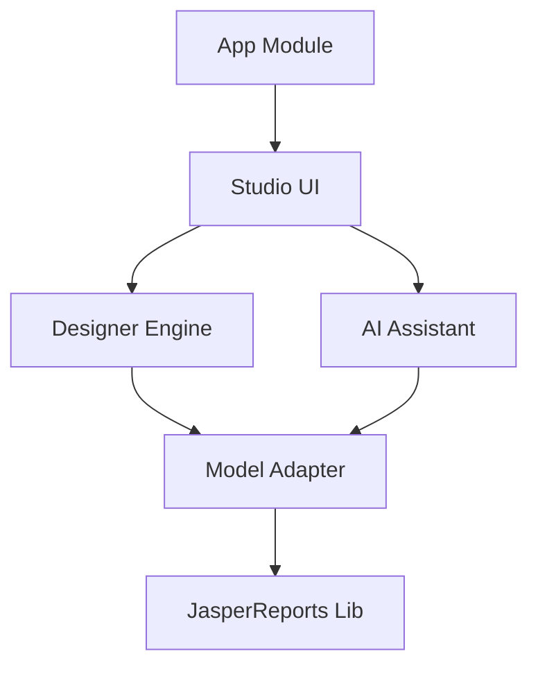
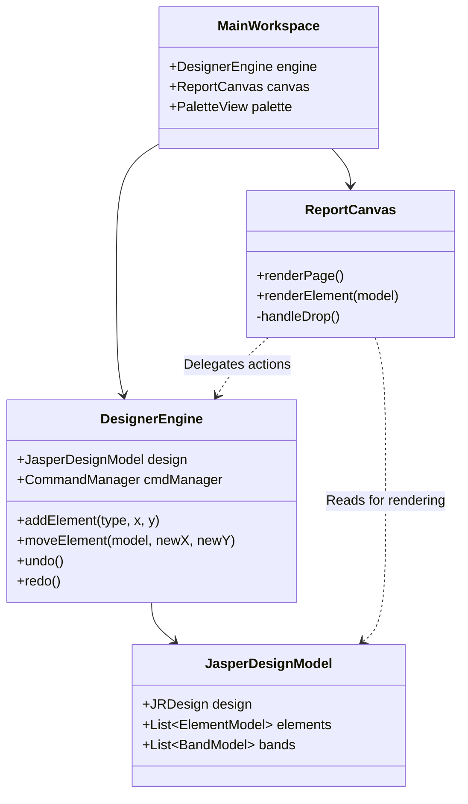
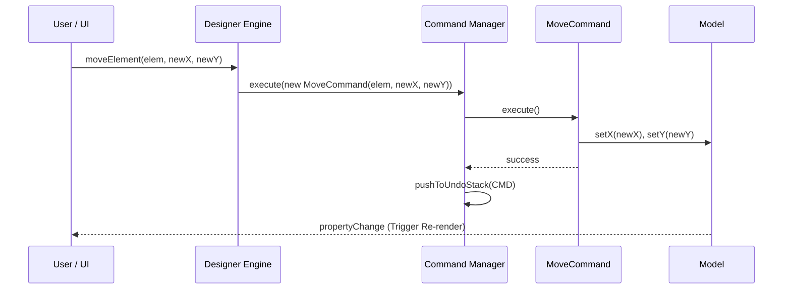

# Jasper Studio FX - Developer Guide

**Current Version:** 1.0.0-SNAPSHOT
**Tech Stack:** Java 21, JavaFX 21, Maven, JasperReports 6.21.0

## 1. Project Overview
**Jasper Studio FX** is a modern, lightweight, and cross-platform Report Designer for JasperReports, built with JavaFX. It aims to provide a responsive, theme-able (Dark/Light mode), and AI-enhanced alternative to the Eclipse-based JasperSoft Studio.

The application allows users to clearly visualize, design, and modify `jrxml` report templates through a drag-and-drop interface.

## 2. System Architecture

The project follows a modular Maven multi-module architecture to separate concerns between UI, Logic, and Model.



### Module Breakdown:

| Module | Description | key Responsibilities |
| :--- | :--- | :--- |
| **`app`** | The Launcher | Entry point (`MainApp`), classpath assembly. |
| **`studio-ui`** | The View Layer | JavaFX Controls, `MainWorkspace`, `ReportCanvas`, `PaletteView`, `PropertiesPane`, CSS Themes. |
| **`designer-engine`** | The Controller/Logic | Managing `JasperDesignModel`, Undo/Redo (`CommandManager`), Clipboard operations, Selection state. |
| **`model-adapter`** | The Data Layer | Wrapper around `net.sf.jasperreports.*`, parsing/saving `.jrxml`, Model-to-DTO conversion. |
| **`ai-assistant`** | Intelligence | Interfaces for AI interaction (`AiService`), Chat UI processing. |

### Core Class Diagram



## 3. Key Features Implemented

### A. Visual Report Designer
*   **Canvas Rendering**: Custom JavaFX implementation (`ReportCanvas.java`) that visually renders JasperReports elements.
*   **Drag and Drop**: Drag elements from the **Palette** (Text, Image, Subreport, Chart) and drop them onto Bands in the Canvas.
*   **Manipulation**:
    *   **Select**: Click to select single elements.
    *   **Move**: Drag elements to reposition.
    *   **Resize**: Drag handles (8-point resize) to change dimensions.
*   **Guides**: Visual Rulers and Grid lines for alignment.

### B. Edit Operations
*   **Undo/Redo**: Full stack-based history support for creation, move, and resize operations.
*   **Cut/Copy/Paste**:
    *   Uses XML Serialization (`JrxmlService`) to place generic JRXML snippets on an internal clipboard.
    *   **Paste Logic**: Auto-offsets pasted elements by (10, 10) pixels for visibility.

### C. Advanced Components
Support for complex elements beyond basic shapes:
*   **Subreports**: Visual placeholder with "Subreport" label. backed by `JRDesignSubreport`.
*   **Charts**: Visual placeholder (Pie Chart style) backed by `JRDesignRectangle` (property-mapped) or `JRDesignChart`.
*   **Crosstabs**: Visual placeholder backed by `JRDesignCrosstab`.
*   **Barcodes**: Visual placeholder backed by `JRDesignImage` with custom properties.

### D. AI Assistant (Beta)
*   **Chat Interface**: Integrated side-panel workflow.
*   **Functionality**:
    *   Interact with a Mock AI service.
    *   "Analyze Design" capability to inspect the current report structure.

### E. User Interface
*   **Modern Look**: Default Dark Mode (`dark.css`).
*   **Responsive Layout**: Resizable panels (Palette, Outline, Properties, Assistant).
*   **Outline View**: Tree-based hierarchy of the report (Bands -> Elements).

## 4. Technical Deep Dive

### rendering Engine (`ReportCanvas.java`)
The canvas does **not** use the JasperReports `JasperViewer` (which is AWT/Swing based). Instead, it implements a **Visual Visitor** pattern:
1.  Iterates through the `JasperDesignModel`.
2.  For each `JRDesignElement`, creates a corresponding JavaFX `Node` (e.g., `Rectangle`, `Label`, `ImageView`).
3.  Binds the JavaFX `layoutX`, `layoutY`, `prefWidth`, `prefHeight` properties bi-directionally to the underlying Jasper Model.
4.  Decorates the Node with `MouseEvents` for selection and drag-handling.

### Command Pattern (`Command.java`)
All state-changing actions are encapsulated in `Command` objects:
*   `CreateElementCommand`
*   `MoveElementCommand`
*   `ResizeElementCommand`
*   `DeleteElementCommand` (Planned)

The `DesignEngine` maintains a `UndoStack` of these commands.

### Command Execution Sequence


### XML Clipboard
To avoid complex deep-cloning logic of Jasper objects, we use serialization:
1.  **Copy**: Serialize selected `JRDesignElement` -> XML String.
2.  **Paste**: Parse XML String -> New `JRDesignElement` -> Add to Model.

## 5. Getting Started

### Prerequisites
*   Java JDK 21+
*   Maven 3.8+

### Build & Run
```bash
# Clean and Build all modules
mvn clean install

# Run the Application
mvn javafx:run -pl app
```

### Troubleshooting
*   **"Cannot find symbol ChartTypeEnum"**: Ensure you are using the correct `net.sf.jasperreports.charts.*` or `engine.type.*` imports matching the 6.21.0 library.
*   **UI Glitches**: If Canvas doesn't update, try resizing the window to trigger a layout pass.

## 6. Future Roadmap
*   **Data Adapters**: JDBC, JSON connectivity.
*   **Expression Editor**: Visual editor for `$F{field}` expressions.
*   **Properties Panel**: Full attribute coverage (currently limited to basics).
*   **Real AI Integration**: Connect `AiService` to OpenAI/Gemini APIs.
