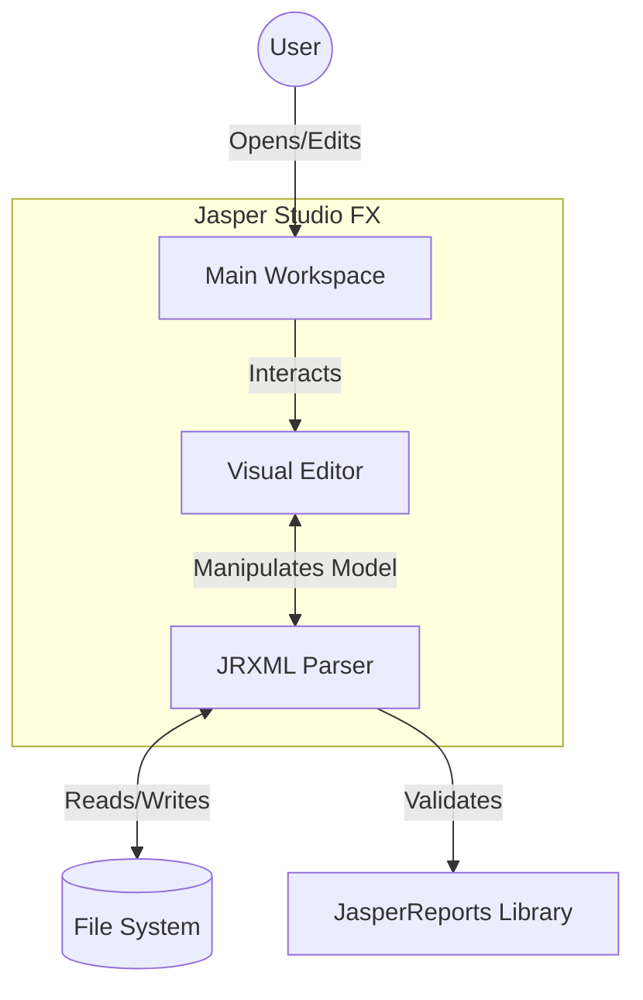
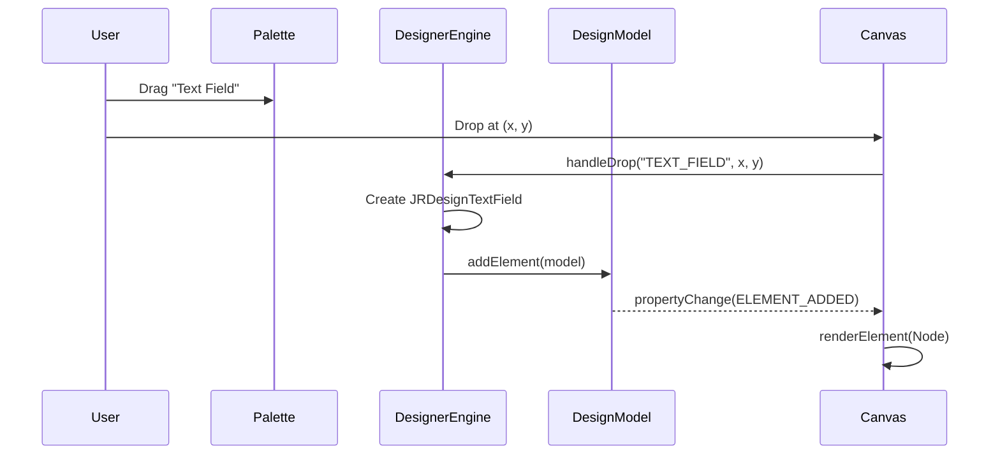

# Software Requirements Specification (SRS)
## Jasper Studio FX

**Version:** 1.0
**Date:** 2026-01-09
**Status:** Draft

---

## 1. Introduction

### 1.1 Purpose
The purpose of this document is to define the functional and non-functional requirements for **Jasper Studio FX**, a modern, lightweight, JavaFX-based report designer for the JasperReports reporting engine. This document is intended for developers, testers, and stakeholders to understand the scope and capabilities of the software.

### 1.2 Scope
Jasper Studio FX allows users to create, modify, and preview `.jrxml` report templates visually. It aims to provide a responsive, aesthetically pleasing (Dark Mode), and efficient alternative to the Eclipse-based Jaspersoft Studio, with specific enhancements in user experience and AI-assisted design.

### 1.3 Definitions and Acronyms
*   **SRS**: Software Requirements Specification
*   **JRXML**: JasperReports XML (Standard file format for JasperReports templates)
*   **JavaFX**: A software platform for creating and delivering desktop applications.
*   **Canvas**: The central visual editing area.
*   **Palette**: The tool panel containing draggable report elements.

---

## 2. Overall Description

### 2.1 Product Perspective
Jasper Studio FX acts as a standalone desktop application. It interfaces directly with the JasperReports Library (v6.21.0+) to parse and validate report structures but provides a custom rendering engine (`ReportCanvas`) for the visual editing experience to decouple UI logic from the report generation engine.

### 2.2 User Characteristics
*   **Report Developers**: Technical users familiar with SQL and JasperReports concepts.
*   **Java Developers**: Users integrating reports into Java applications.
*   **Business Analysts**: Users needing quick adjustments to report layouts.

### 2.3 Key Constraints
*   Must run on Java 21+ environments.
*   Must support macOS, Windows, and Linux (Cross-platform JavaFX).
*   Must maintain backward compatibility with standard JRXML structure where possible.

### 2.4 System Context Diagram

---

## 3. Specific Requirements

### 3.1 Functional Requirements

#### 3.1.1 Visual Design
*   **FR-01 Canvas Rendering**: The system shall visually render report bands (Title, Detail, Footer, etc.) and elements within them.
*   **FR-02 Drag and Drop**: Users shall be able to drag elements (Text Field, Static Text, Image, Rectangle, Ellipse, Line, Break, Frame) from the Palette to the Canvas.
*   **FR-03 Selection**: Users shall be able to select single or multiple elements on the canvas.
*   **FR-04 Manipulation**:
    *   **FR-04.1 Move**: Users shall be able to drag selected elements to new coordinates.
    *   **FR-04.2 Resize**: Users shall be able to resize elements using 8-point handles.
    *   **FR-04.3 Snap**: Elements shall optionally snap to grid lines or other elements for alignment.

#### 3.1.2 Sequence Diagram: Element Creation

#### 3.1.3 Advanced Components
*   **FR-05 Subreports**: The system shall support `JRDesignSubreport` elements, rendering them as labeled placeholders.
*   **FR-06 Charts**: The system shall support `JRDesignChart` elements, rendering them as visual placeholders.
*   **FR-07 Crosstabs**: The system shall support `JRDesignCrosstab` elements.
*   **FR-08 Barcodes**: The system shall support Barcode elements (via Component or Image wrapper).

#### 3.1.3 Edit Operations
*   **FR-09 Undo/Redo**: The system shall provide an infinite Undo/Redo stack for creation, move, and resizing operations.
*   **FR-10 Cut/Copy/Paste**:
    *   Typically supported via keyboard shortcuts and menu items.
    *   The system shall serialize elements to an internal clipboard for copying.
    *   The system shall apply a visual offset (currently 10px) to pasted elements.

#### 3.1.4 File Management
*   **FR-11 Open/Save**: Users shall be able to open existing `.jrxml` files and save changes.
*   **FR-12 Source View**: Users shall be able to view and edit the raw XML source code of the report.

#### 3.1.5 AI Assistance
*   **FR-13 Chat Interface**: The system shall provide an embedded AI chat panel.
*   **FR-14 Design Analysis**: The AI shall be able to read the current `JasperDesignModel` and provide insights or suggestions (Mock implementation currently).

### 3.2 Non-Functional Requirements

#### 3.2.1 Performance
*   **NFR-01 Startup Time**: The application should launch to the main workspace in under 3 seconds on standard hardware.
*   **NFR-02 Rendering**: Canvas refreshes during drag operations should be smooth (target 60fps).

#### 3.2.2 Usability
*   **NFR-03 Theming**: The application shall support Dark Mode and Light Mode, defaulting to a high-contrast Dark Mode.
*   **NFR-04 Responsive Layout**: UI panels (Palette, Properties) must be collapsible or resizable.

#### 3.2.3 Reliability
*   **NFR-05 Exception Handling**: Invalid JRXML should not crash the application but present a readable error.

### 3.3 Interface Requirements
*   **UI**: JavaFX 21 with CSS styling.
*   **Library**: JasperReports Library 6.21.0.

---

## 4. Appendices

### 4.1 Roadmap Features
*   Visual Query Builder (JDBC integration)
*   Dataset Run configuration for Charts/Tables
*   Expression Editor with syntax highlighting
*   Integration with JasperReports Server REST API
